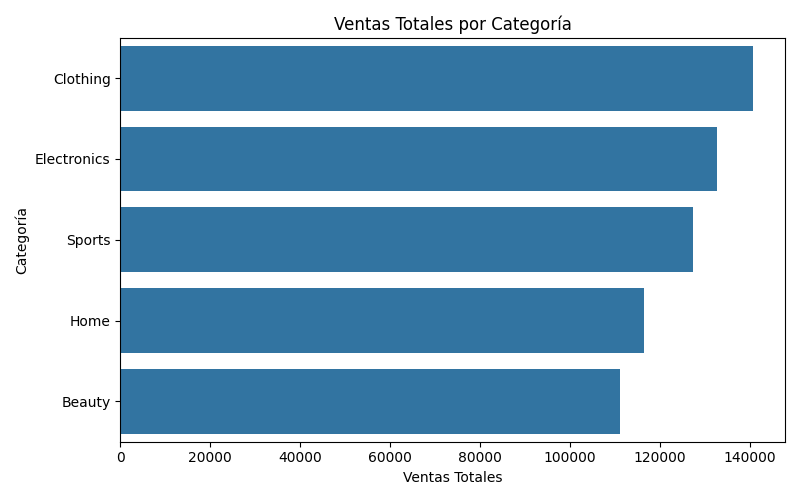
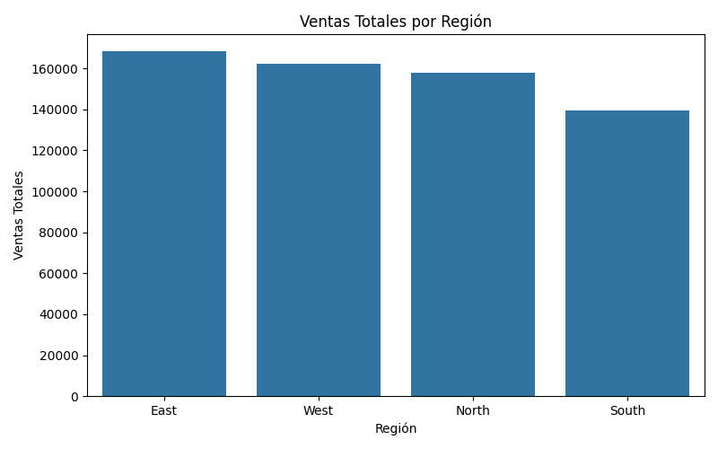
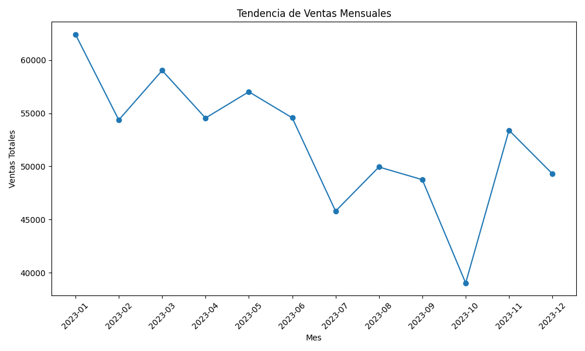
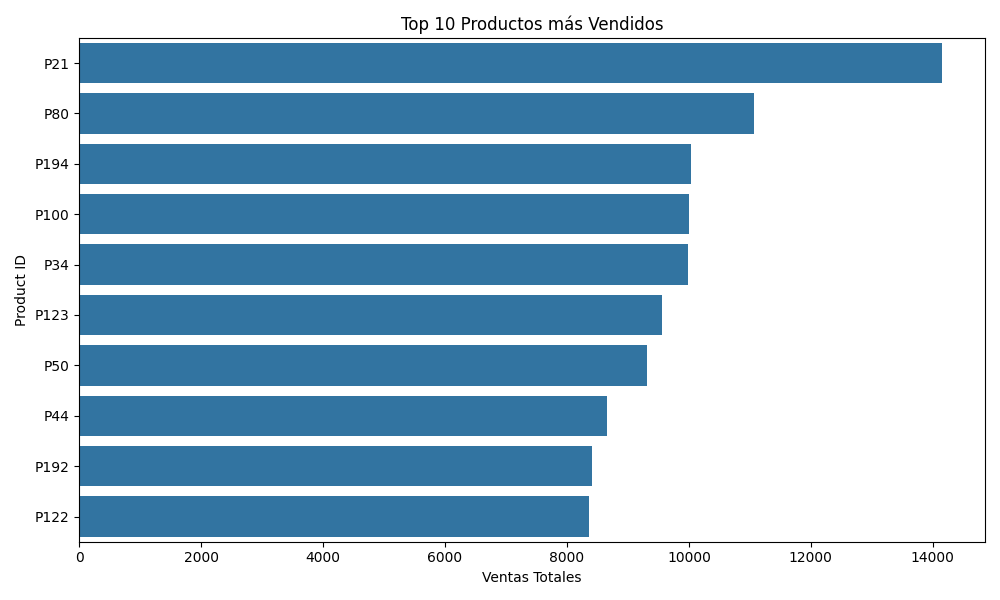

# 🛒 Análisis de Ventas E-commerce

Este repositorio contiene un proyecto de análisis de datos simulado de ventas en línea.  
El objetivo es aplicar técnicas de **Data Analytics** y **Business Intelligence** usando Python y Power BI.

---

## 📂 Estructura del repositorio

```
ecommerce_project/
│── data/          -> dataset original y limpios (CSV)
│── scripts/       -> scripts de Python (.py)
│── images/        -> capturas y visualizaciones
│── README.md      -> descripción general del proyecto
```                                                                                                                                                                      ## 📈 Visualizaciones

1. **Ventas por Categoría**
   

2. **Ventas por Región**
   

3. **Tendencia Mensual de Ventas**
   

4. **Top 10 Productos más Vendidos**
                                                                                                                                                                                                                                                                                                              
---

## 🚀 Instrucciones de uso

1. Clonar el repositorio
   ```bash
   git clone https://github.com/TU_USUARIO/ecommerce_project.git
   cd ecommerce_project
   ```

2. Instalar dependencias
   ```bash
   pip install pandas matplotlib seaborn
   ```

3. Ejecutar el script principal
   ```bash
   python scripts/ecommerce_analysis_base.py
   ```

---

## 📌 Autor
👨‍💻 **Héctor Acevedo**  
Data Analytics & Business Intelligence  
[LinkedIn](https://www.linkedin.com/in/acevedohector09/)  
